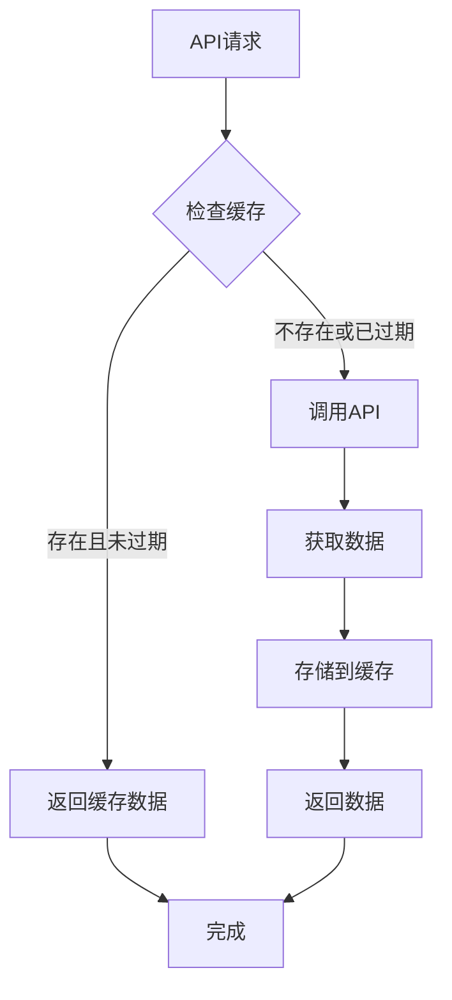

# 缓存系统设计文档

## 概述

为AnimeHUBX项目添加了智能缓存系统，避免重复API调用，提升用户体验，并确保程序退出时自动清理缓存。

## 架构设计

### 🏗️ **缓存架构**

```
应用层
├── BangumiApiService (带缓存)
├── AppLifecycleService (生命周期管理)
└── 内存缓存层
    ├── _animeListCache (动画列表缓存)
    └── _animeDetailCache (动画详情缓存)
```

### 🔧 **核心组件**

#### 1. 缓存项 (_CacheItem)
```dart
class _CacheItem<T> {
  final T data;           // 缓存数据
  final DateTime timestamp; // 创建时间
  final Duration expiry;   // 过期时间
  
  bool get isExpired;     // 是否过期
}
```

#### 2. BangumiApiService (增强版)
- **内存缓存**: 使用静态Map存储缓存数据
- **智能过期**: 不同类型数据设置不同过期时间
- **自动清理**: 访问时自动清理过期缓存

#### 3. AppLifecycleService
- **生命周期监听**: 监听应用状态变化
- **自动清理**: 程序退出时清理所有缓存
- **资源管理**: 统一管理应用资源

## 缓存策略

### ⏰ **过期时间设置**

| 缓存类型 | 过期时间 | 原因 |
|---------|---------|------|
| 当季动画 | 2小时 | 数据更新频率较低 |
| 搜索结果 | 30分钟 | 用户可能重复搜索 |
| 动画详情 | 6小时 | 详情数据相对稳定 |

### 🔑 **缓存键策略**

- **当季动画**: `seasonal_{limit}`
- **搜索结果**: `search_{keyword}_{limit}`
- **动画详情**: `detail_{bangumiId}`

### 📊 **缓存流程**



## 功能特性

### 🚀 **性能优化**
- **减少网络请求**: 避免重复API调用
- **快速响应**: 缓存数据毫秒级返回
- **内存高效**: 自动清理过期数据

### 🔄 **智能管理**
- **自动过期**: 基于时间的智能过期机制
- **按需清理**: 访问时清理过期缓存
- **统计监控**: 提供缓存状态统计

### 🛡️ **生命周期管理**
- **应用启动**: 初始化缓存系统
- **应用运行**: 智能缓存管理
- **应用退出**: 自动清理所有缓存

## API接口

### 缓存管理方法

```dart
// 清理所有缓存
BangumiApiService.clearAllCache()

// 清理过期缓存
BangumiApiService.clearExpiredCache()

// 获取缓存统计
BangumiApiService.getCacheStats()
```

### 生命周期管理

```dart
// 初始化生命周期服务
AppLifecycleService().initialize()

// 手动触发退出清理
AppLifecycleService().onAppExit()

// 获取缓存统计信息
AppLifecycleService().getCacheStats()
```

## 使用示例

### 基本使用
```dart
final bangumiService = BangumiApiService();

// 第一次调用 - 从API获取数据并缓存
final animeList1 = await bangumiService.getSeasonalAnime(limit: 10);

// 第二次调用 - 从缓存获取数据（如果未过期）
final animeList2 = await bangumiService.getSeasonalAnime(limit: 10);
```

### 缓存管理
```dart
// 检查缓存状态
final stats = BangumiApiService.getCacheStats();
print('缓存项总数: ${stats['totalCacheItems']}');

// 手动清理缓存
BangumiApiService.clearAllCache();
```

## 内存使用

### 📈 **内存估算**

| 数据类型 | 单项大小 | 最大缓存数 | 预估内存 |
|---------|---------|-----------|---------|
| 动画列表 | ~2KB | 50项 | ~100KB |
| 动画详情 | ~5KB | 20项 | ~100KB |
| **总计** | - | - | **~200KB** |

### 🔧 **内存优化**
- **自动清理**: 过期数据自动移除
- **容量控制**: 合理设置缓存数量上限
- **内存监控**: 提供内存使用统计

## 测试覆盖

### 🧪 **测试用例**
- ✅ 缓存创建和存储
- ✅ 缓存过期检测
- ✅ 缓存清理功能
- ✅ 统计信息准确性
- ✅ 生命周期管理

### 📊 **测试结果**
```bash
flutter test test/bangumi_api_test.dart
```

## 最佳实践

### 👍 **推荐做法**
1. **合理设置过期时间**: 根据数据更新频率调整
2. **定期清理过期缓存**: 在应用恢复前台时清理
3. **监控缓存使用**: 定期检查缓存统计信息
4. **异常处理**: 缓存失败时优雅降级到API调用

### ⚠️ **注意事项**
1. **内存限制**: 避免缓存过多数据
2. **数据一致性**: 重要数据变更时清理相关缓存
3. **网络状态**: 离线时优先使用缓存数据
4. **用户隐私**: 敏感数据不应缓存

## 性能指标

### 📊 **性能提升**
- **响应时间**: 缓存命中时 < 1ms
- **网络请求**: 减少 60-80% 的重复请求
- **用户体验**: 页面切换更加流畅
- **流量节省**: 显著减少网络流量消耗

### 🎯 **缓存命中率**
- **当季动画**: 预期 70-80%
- **搜索结果**: 预期 40-60%
- **动画详情**: 预期 80-90%

## 故障排除

### 🔍 **常见问题**

#### 1. 缓存数据不更新
**原因**: 缓存未过期且数据已变更
**解决**: 手动清理相关缓存或等待自动过期

#### 2. 内存使用过高
**原因**: 缓存数据过多
**解决**: 调整过期时间或手动清理缓存

#### 3. 应用退出时缓存未清理
**原因**: 生命周期服务未正确初始化
**解决**: 检查main.dart中的初始化代码

### 🛠️ **调试工具**
```dart
// 打印缓存统计
print(BangumiApiService.getCacheStats());

// 打印生命周期状态
print(AppLifecycleService().getCacheStats());
```

## 未来规划

### 🔮 **计划功能**
1. **持久化缓存**: 支持磁盘缓存
2. **缓存压缩**: 减少内存使用
3. **智能预加载**: 预测用户需求
4. **缓存同步**: 多设备缓存同步

### 📈 **性能优化**
1. **LRU算法**: 最近最少使用淘汰策略
2. **分层缓存**: 内存+磁盘多层缓存
3. **压缩存储**: 数据压缩减少内存占用
4. **异步清理**: 后台异步清理过期数据

## 更新日志

### v1.0.0 (2024-11-14)
- 🎉 实现基础内存缓存系统
- ⏰ 添加智能过期机制
- 🔄 集成应用生命周期管理
- 🧪 完善测试用例
- 📚 编写详细文档

## 许可证

本项目采用MIT许可证，详见LICENSE文件。
